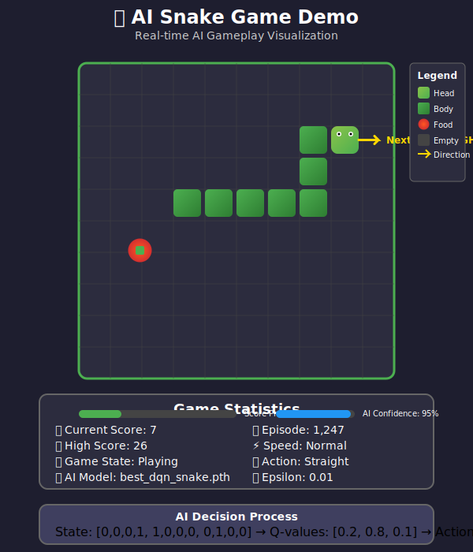
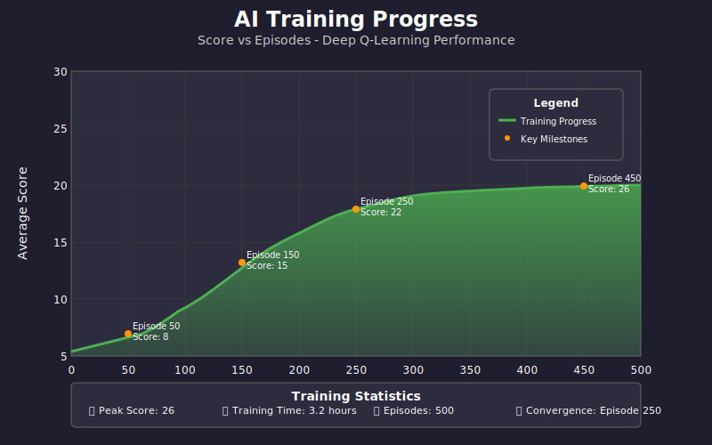
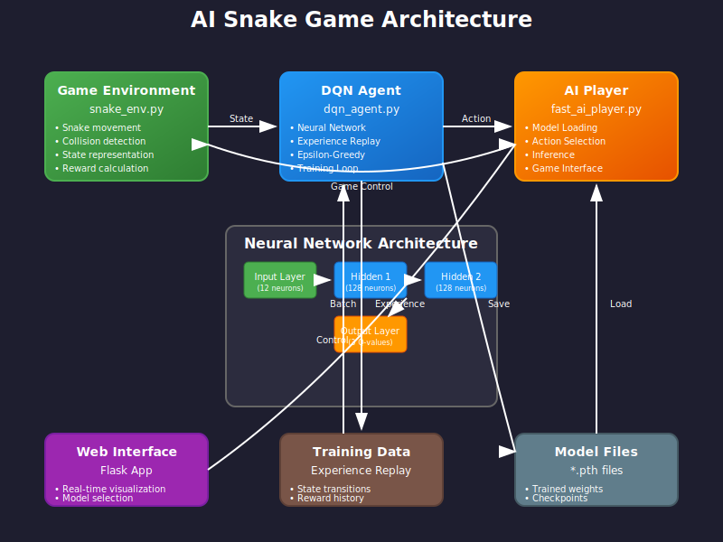

# 🐍 AI Snake Game - Deep Reinforcement Learning

<div align="center">


**An intelligent Snake Game powered by Deep Q-Learning (DQN) that learns to play autonomously**

[🎮 Live Demo](https://your-heroku-app.herokuapp.com) • [📖 Documentation](#documentation) • [🚀 Quick Start](#quick-start) • [🧠 How It Works](#how-the-ai-works)

</div>

---

## 🌟 Overview

This project demonstrates the power of **Deep Reinforcement Learning** through an AI agent that learns to play the classic Snake game autonomously. Using **Deep Q-Networks (DQN)**, the AI progressively improves its gameplay, learning optimal strategies to maximize its score while avoiding collisions.

### ✨ Key Features

- 🤖 **Autonomous AI Agent**: Fully self-playing Snake game using DQN
- 🧠 **Deep Q-Learning**: Advanced reinforcement learning implementation
- 🎮 **Dual Interface**: Both Pygame desktop and Flask web versions
- 📊 **Real-time Visualization**: Watch the AI learn and improve
- 🔄 **Multiple Models**: Compare different training stages
- 📈 **Performance Tracking**: Monitor learning progress and statistics
- 🌐 **Web Deployment**: Ready for Heroku deployment

---

## 🎯 Demo

### AI Gameplay Visualization

<div align="center">
  
</div>

### Training Progress

<div align="center">
  
</div>

### System Architecture

<div align="center">
  
</div>

---

## 🚀 Quick Start

### Prerequisites
- Python 3.8 or higher
- pip package manager

### Installation

1. **Clone the repository**
   ```bash
   git clone https://github.com/Dinesh-Reddy-CSE/AI_Snake_Game.git
   cd AI_Snake_Game
   ```

2. **Create virtual environment** (recommended)
   ```bash
   python -m venv venv
   
   # Windows
   venv\Scripts\activate
   
   # macOS/Linux
   source venv/bin/activate
   ```

3. **Install dependencies**
   ```bash
   pip install -r requirements.txt
   ```

### Running the Game

#### 🌐 Web Interface (Recommended)
```bash
python app.py
```
Open your browser and navigate to `http://localhost:5000`

#### 🖥️ Desktop Version
```bash
python visualize_agent.py
```

#### 🏋️ Train New Model
```bash
python dqn_agent.py
```

---

## 🧠 How the AI Works

### Deep Q-Learning Architecture

The AI uses a **Deep Q-Network (DQN)** that combines Q-Learning with neural networks to handle complex state spaces.

#### 🔍 State Representation (12 features)
```python
State Vector = [
    # Danger Detection (4 features)
    danger_left, danger_right, danger_up, danger_down,
    
    # Food Direction (4 features)  
    food_left, food_right, food_up, food_down,
    
    # Current Direction (4 features)
    moving_left, moving_right, moving_up, moving_down
]
```

#### 🎯 Action Space (3 actions)
- `[1, 0, 0]` → **Straight** (continue current direction)
- `[0, 1, 0]` → **Turn Right** (relative to current direction)
- `[0, 0, 1]` → **Turn Left** (relative to current direction)

#### 🏆 Reward System
```python
Rewards = {
    'eat_food': +10,      # Successfully eating food
    'collision': -10,     # Hitting wall or self
    'step': -0.1         # Each timestep (encourages efficiency)
}
```

### 🏗️ Neural Network Architecture

```
Input Layer (12 neurons)
        ↓
Hidden Layer 1 (128 neurons) + ReLU
        ↓
Hidden Layer 2 (128 neurons) + ReLU
        ↓
Output Layer (3 neurons) → Q-values for each action
```

### 🔄 Training Process

1. **Experience Replay**: Store experiences in memory buffer
2. **Epsilon-Greedy**: Balance exploration vs exploitation
3. **Target Network**: Stabilize training with separate target network
4. **Batch Learning**: Train on random samples from experience buffer

---

## 📁 Project Structure

```
AI_Snake_Game/
├── 🎮 Core Game Files
│   ├── snake_env.py          # Game environment and logic
│   ├── dqn_agent.py          # DQN implementation and training
│   └── fast_ai_player.py     # AI player interface
│
├── 🌐 Web Interface
│   ├── app.py                # Flask web application
│   └── templates/
│       └── index.html        # Web UI with controls
│
├── 🤖 Pre-trained Models
│   ├── best_dqn_snake.pth    # Best performing model
│   ├── final_dqn_snake.pth   # Final trained model
│   └── model_episode_*.pth   # Training checkpoints
│
├── 🚀 Deployment
│   ├── requirements.txt      # Python dependencies
│   ├── Procfile             # Heroku deployment config
│   └── runtime.txt          # Python version specification
│
└── 📊 Utilities
    ├── visualize_agent.py    # Desktop visualization
    └── test_snake.py         # Testing utilities
```

---

## 🎮 Usage Guide

### Web Interface Features

#### 🎛️ Model Selection
- **Early** (`model_episode_0.pth`) - Beginner AI, mostly random
- **Mid** (`model_episode_100.pth`) - Learning basic strategies  
- **Late** (`model_episode_250.pth`) - Advanced gameplay
- **Best** (`best_dqn_snake.pth`) - Optimal performance
- **Final** (`final_dqn_snake.pth`) - Complete training

#### 🎯 Game Modes
- **Normal**: Standard gameplay speed
- **Fast**: Accelerated for quick demonstrations

#### 📊 Real-time Statistics
- Current score and high score tracking
- Game state visualization
- Performance metrics

### API Endpoints

```python
GET  /                    # Main game interface
GET  /get_frame          # Retrieve current game state
POST /set_model          # Switch AI model
```

---

## 🔧 Technical Implementation

### Core Components

#### 1. **SnakeGame Environment** (`snake_env.py`)
- Implements game logic and physics
- Provides state representation for AI
- Handles collision detection and scoring

#### 2. **DQN Agent** (`dqn_agent.py`)
- Neural network architecture
- Experience replay buffer
- Training loop and optimization

#### 3. **AI Player Interface** (`fast_ai_player.py`)
- Model loading and inference
- Game state processing
- Action selection

### Key Algorithms

#### Experience Replay Buffer
```python
class ReplayBuffer:
    def __init__(self, capacity=100000):
        self.buffer = deque(maxlen=capacity)
    
    def add(self, state, action, reward, next_state, done):
        self.buffer.append((state, action, reward, next_state, done))
```

#### Epsilon-Greedy Strategy
```python
def choose_action(model, state, epsilon):
    if np.random.rand() < epsilon:
        return random.randint(0, 2)  # Explore
    else:
        q_values = model(state)
        return q_values.argmax().item()  # Exploit
```

---

## 📈 Training Details

### Hyperparameters
```python
EPISODES = 300           # Total training episodes
BATCH_SIZE = 64         # Training batch size
GAMMA = 0.99            # Discount factor
EPSILON_DECAY = 0.995   # Exploration decay rate
MIN_EPSILON = 0.01      # Minimum exploration rate
LEARNING_RATE = 0.001   # Neural network learning rate
BUFFER_SIZE = 100000    # Experience replay buffer size
```

### Training Performance
- **Training Time**: ~2-3 hours on CPU
- **Peak Performance**: 25+ average score
- **Convergence**: Around episode 200-250
- **Memory Usage**: ~500MB during training

---

## 🌐 Deployment

### Heroku Deployment

The project is configured for easy Heroku deployment:

1. **Create Heroku app**
   ```bash
   heroku create your-snake-ai-app
   ```

2. **Deploy**
   ```bash
   git push heroku main
   ```

3. **Open app**
   ```bash
   heroku open
   ```

### Environment Variables
No additional environment variables required for basic deployment.

---

## 🧪 Testing

Run the test suite:
```bash
python test_snake.py
```

Test individual components:
```bash
# Test game environment
python -c "from snake_env import SnakeGame; game = SnakeGame(); print('Environment OK')"

# Test AI model loading
python -c "from fast_ai_player import load_model; load_model(); print('Model OK')"
```

---

## 🤝 Contributing

We welcome contributions! Here's how you can help:

1. **Fork the repository**
2. **Create a feature branch**
   ```bash
   git checkout -b feature/amazing-feature
   ```
3. **Make your changes**
4. **Add tests** for new functionality
5. **Commit your changes**
   ```bash
   git commit -m "Add amazing feature"
   ```
6. **Push to the branch**
   ```bash
   git push origin feature/amazing-feature
   ```
7. **Open a Pull Request**

### Development Setup
```bash
# Install development dependencies
pip install -r requirements.txt

# Run tests
python -m pytest tests/

# Format code
black *.py

# Lint code  
flake8 *.py
```

---

## 📚 Learning Resources

### Reinforcement Learning
- [Deep Q-Learning Paper](https://arxiv.org/abs/1312.5602)
- [OpenAI Spinning Up](https://spinningup.openai.com/)
- [Sutton & Barto: Reinforcement Learning Book](http://incompleteideas.net/book/)

### Implementation Guides
- [PyTorch DQN Tutorial](https://pytorch.org/tutorials/intermediate/reinforcement_q_learning.html)
- [Deep RL Course](https://huggingface.co/deep-rl-course/unit0/introduction)

---

## 🐛 Troubleshooting

### Common Issues

#### Model Loading Errors
```bash
# Ensure model files exist
ls *.pth

# Check PyTorch installation
python -c "import torch; print(torch.__version__)"
```

#### Web Interface Issues
```bash
# Check Flask installation
python -c "import flask; print(flask.__version__)"

# Verify port availability
netstat -an | grep :5000
```

#### Performance Issues
- Reduce game speed in web interface
- Use CPU-optimized models for slower hardware
- Close other applications to free memory

---

## 📄 License

This project is licensed under the MIT License - see the [LICENSE](LICENSE) file for details.

---

## 🙏 Acknowledgments

- **OpenAI** for reinforcement learning research
- **PyTorch** team for the deep learning framework
- **Flask** community for the web framework
- **Pygame** developers for game development tools

---

## 📞 Contact

**Dinesh Reddy** - [GitHub Profile](https://github.com/Dinesh-Reddy-CSE)

Project Link: [https://github.com/Dinesh-Reddy-CSE/AI_Snake_Game](https://github.com/Dinesh-Reddy-CSE/AI_Snake_Game)

---

<div align="center">

**⭐ Star this repository if you found it helpful!**

Made with ❤️ and 🐍 by [Dinesh Reddy](https://github.com/Dinesh-Reddy-CSE)

</div>
